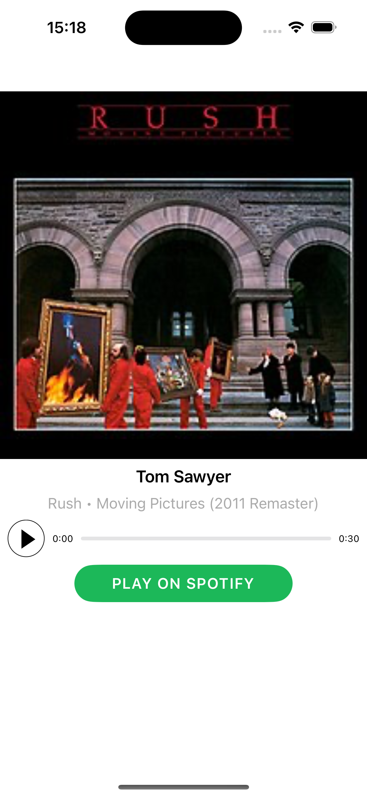
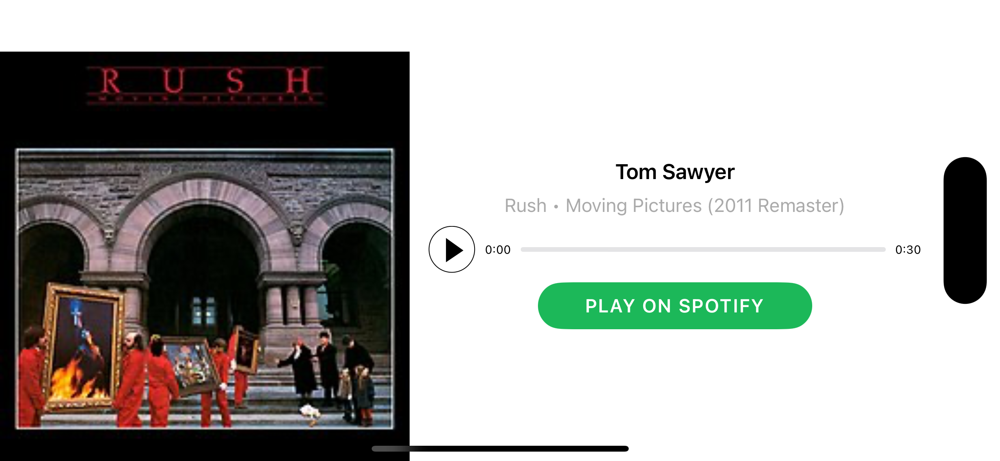

# Auto Layout 
In this project, I'm working on a practical project where I learn how to do Auto Layout completely programmatically and how to layout the user interface components to be adjusted according to size and orientation.

## TOPICS COVERED

- Constraints

- Pinning & Aligning
 
- Intrinsic Content Size
 
- Content Hugging & Compression Resistance
 
- Layout Guides
 
- Safe Areas
 
- Priorities
 
- Stack Views
 
- Scroll Views

  
  

